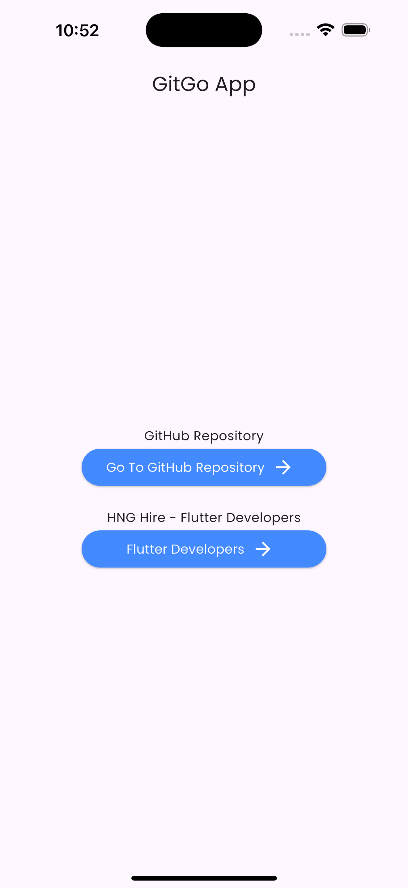
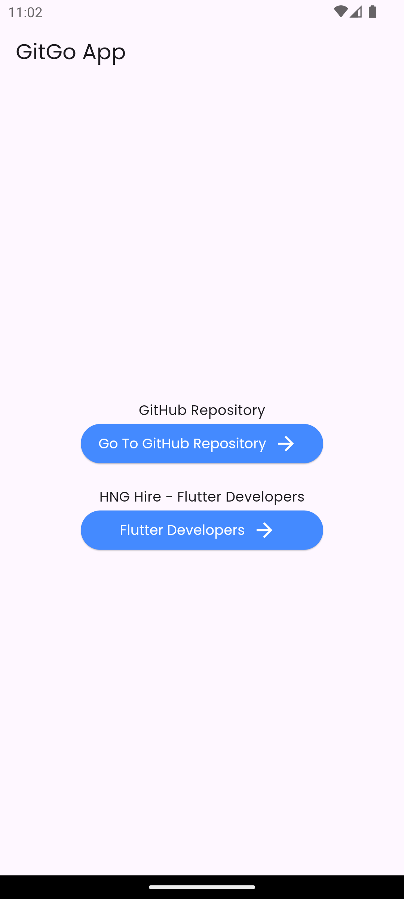

# GitGo Mobile Application

## Overview

GitGo is a mobile application developed using Flutter, designed to help users go to it's github repository of the app and hng flutter developer page. The app uses url_launcher package from pub.dev to handle url launching.

## Features

- **Url Launcher**: use url_launcher from pub.dev

## Technologies Used

- **Flutter**: For building the cross-platform mobile application.

## Screenshots

- 
- 

## Installation

1. **Clone the repository**:
    ```bash
    git clone https://github.com/Luckystartech/GitGo.git
    cd gitgo_app
    ```

2. **Install dependencies**:
    ```bash
    flutter pub get
    ```

3. **Run the app**:
    ```bash
    flutter run
    ```

## Folder Structure

lib/
├── main.dart # Entry point of the application
├── features/ # all features of gitco_app
├── features/home # contains all home features and screens
└── features/home/controllers # controllers for the home features

yaml
Copy code

## Contributing

1. Fork the repository.
2. Create your feature branch (`git checkout -b feature/AmazingFeature`).
3. Commit your changes (`git commit -m 'Add some AmazingFeature'`).
4. Push to the branch (`git push origin feature/AmazingFeature`).
5. Open a pull request.


## Contact

If you have any questions or suggestions, feel free to reach out to me at [gmail](luckyekpebe123@gmail.com).